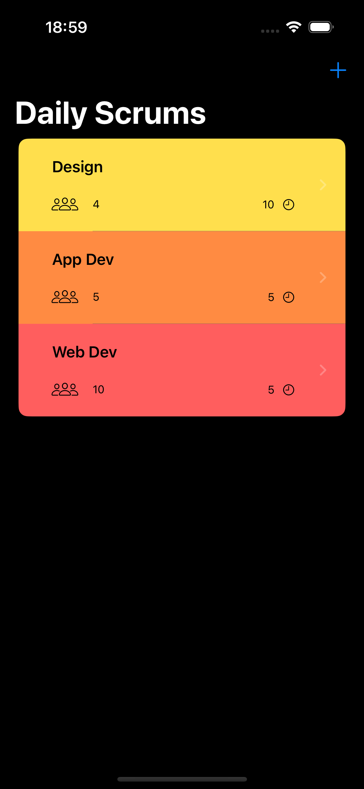
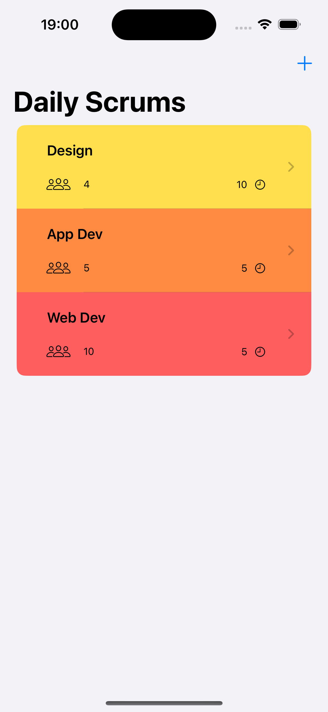
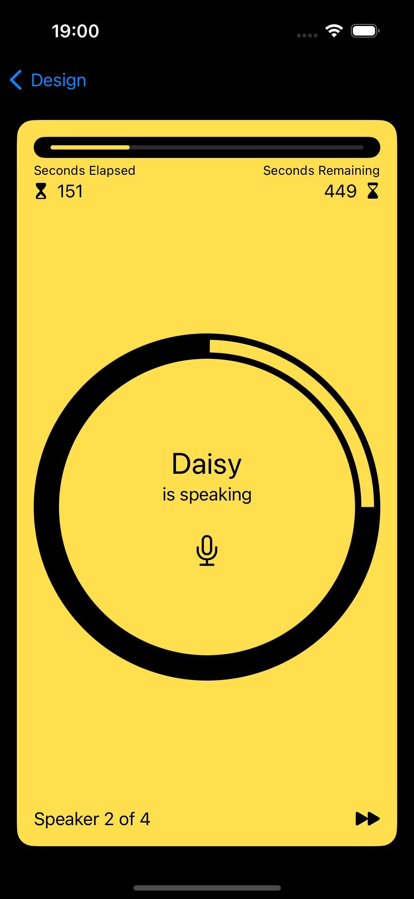
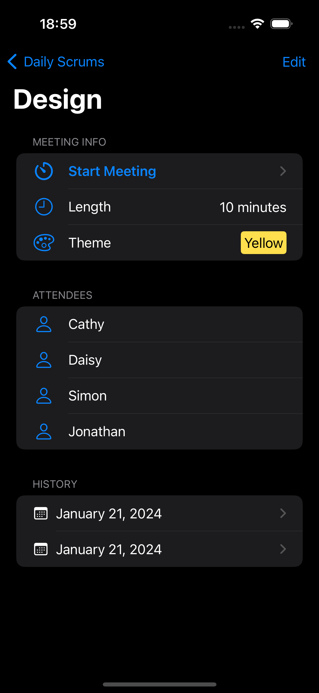
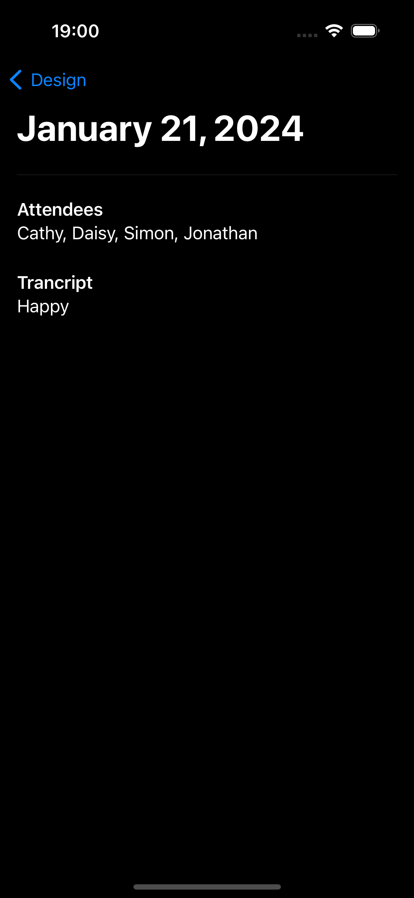

# Scrumdinger

App developed as part of the tutorial provided by Apple at https://developer.apple.com/tutorials/app-dev-training/getting-started-with-scrumdinger.

## Result

The final app looks like the screenshots below:

<table>
<thead>
<th>Main screen - Light theme</th>
<th>Main screen - Dark theme</th>
<th>Current meeting view</th>
<th>Details view</th>
<th>History view</th>
</thead>
<tbody>
<tr>
<td>

</td>
<td>

</td>
<td>

</td>
<td>

</td>
<td>

</td>
</tr>
</tbody>
</table>
